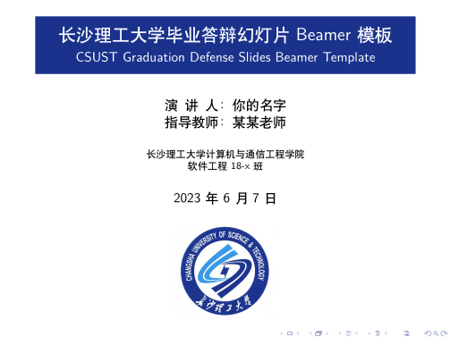
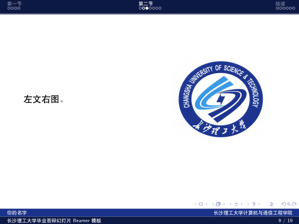
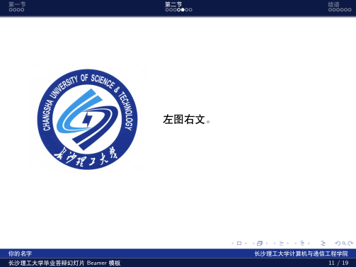
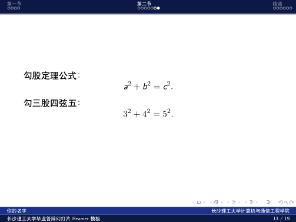

# CSUST Graduation Defense Slides Beamer Template

> 长沙理工大学毕业答辩幻灯片 Beamer 模板

本项目曾是[长沙理工大学本科生毕业论文 LaTeX 模板](https://github.com/csust-latex-sig/CSUSTBachelorThesis)的一部分。



## 使用

使用前请确保你具有基本的 LaTeX 知识，相关工具及安装介绍见[长沙理工大学本科生毕业论文 LaTeX 模板使用指南](https://github.com/csust-latex-sig/CSUSTBachelorThesis/releases/latest/download/thesis.pdf)。

本模板需要两次 XeLaTeX 编译才能正确生成目录，编译命令如下：

```bash
xelatex slides && xelatex slides
```

如果你安装了 Make，也可以使用：

```bash
make slides
```

## 展示

> 完整幻灯片可在 [Releases](https://github.com/csust-latex-sig/CSUSTGraduationSlides/releases) 页面查看。

左文右图：



左图右文：



数学环境：



## 交流

欢迎加入**长沙理工大学 LaTeX 交流群**。QQ 群号：169929184。


